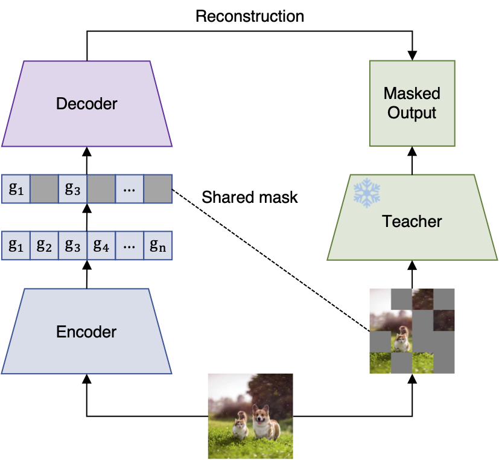

# Locality Alignment

[](https://arxiv.org/abs/2410.11087)
[](https://pytorch.org/get-started/locally/)
[](https://github.com/huggingface/pytorch-image-models)
[](LICENSE)

This is a repository for *locality alignment*, a post-training stage that helps vision transformers (ViTs) better extract local image semantics (i.e., class contents for each image region). We use an efficient fine-tuning procedure called masked embedding self-consistency (MaskEmbed) to teach this capability using only self-supervision. Our technique is introduced in [this paper](https://arxiv.org/abs/2410.11087).

Locality alignment is useful for pre-trained backbones like CLIP and SigLIP that are only exposed to image-level supervision (e.g., image-caption pairs) instead of dense, region-level supervision. Our paper shows improved performance on a local feature probing benchmark, as well as several vision-language model (VLM) benchmarks. See our repositories below for usage in these tasks:

- [Probing benchmark](https://github.com/iancovert/patch-seg)
- [Vision-language models](https://github.com/iancovert/prismatic-vlms)


# Installation and usage

First, clone the repository and install it in your conda environment:

```bash
git clone https://github.com/iancovert/locality-alignment.git
cd locality-alignment
pip install -e .
```

Training utilities are provided in the `locality_alignment` package, our model configs are in `configs`, and the main training script is in `scripts/train.py`.

**Data.** Before training you first need to set up your training dataset, for example ImageNet1k or ImageNet21k. If these are already downloaded on your machine, you can symlink them at `data/imagenet` and `data/imagenet21k`. Otherwise, you can download each dataset using the standard approach (see [here](https://github.com/pytorch/examples/tree/main/imagenet) for ImageNet1k and [here](https://arxiv.org/abs/2104.10972) for ImageNet21k).

**Launching training.** Jobs should be launched from the root directory of the repository, and the easiest way to specify hyperparameters is with a config file. To launch a training run with the CLIP ViT-B backbone on 4 GPUs, you can use the following command:

```bash
torchrun --standalone --nnodes=1 --nproc-per-node=4 scripts/train.py --config configs/clip-vit-b.yaml
```

To train on a single GPU, you can launch directly with Python:

```bash
python scripts/train.py --config configs/clip-vit-b.yaml
```

Training progress is logged to wandb, and checkpoints are saved in the `output` directory.

# How it works

The key idea behind MaskEmbed is that pre-trained models have latent knowledge of local semantics that we can extract using masking. As a source of self-supervision, we mask out patches and use the frozen model to produce a masked view, which only encodes the unmasked contents. We then fork the model into a trainable copy accompanied by a lightweight decoder, and use these to predict the masked view: the fine-tuned encoder predicts rich patch embeddings given the unmasked image, which are masked and then passed to the decoder to predict the masked view. The model is trained to minimize the difference between these two predictions.

<p align="center">
  
</p>

# Checkpoints

We provide checkpoints for several locality-aligned backbones, which are listed in the table below:

| Backbone | Paper | Dataset | Checkpoint |
|----------|-------|---------|------------|
| CLIP ViT-B | [link](https://arxiv.org/abs/2103.00020) | ImageNet-21k | [link](https://drive.google.com/file/d/1jZcgXIRXSoObN0HmFjjd9Plp-U91C9a7/view?usp=share_link) |
| CLIP ViT-L | [link](https://arxiv.org/abs/2103.00020) | ImageNet-21k | [link](https://drive.google.com/file/d/1IL_bbEyT1nvm-TUQLQw-7XIIAbrdv5PC/view?usp=share_link) |
| CLIP ViT-L @ 336px | [link](https://arxiv.org/abs/2103.00020) | ImageNet-21k | [link](https://drive.google.com/file/d/1PyV7aSvQWiisruFx7f7XZFk72Dl1cRzE/view?usp=share_link) |
| SigLIP ViT-SO400M @ 384px | [link](https://arxiv.org/abs/2103.00020) | ImageNet-21k | [link](https://drive.google.com/file/d/1hKIEXqREqVsPim1aIrJtFHUSplj2varv/view?usp=share_link) |

To load the ViT backbone from a checkpoint, you can initialize the model with timm and then load the checkpoint with our `load_checkpoint_auto` function:

```python
import timm
from locality_alignment import load_checkpoint_auto

# Setup assuming CLIP ViT-L/14 @ 336px.
arch_name = "svit_large_patch14_clip_quickgelu_336.openai"
checkpoint_name = "clip-vit-l-336.pth.tar"
# or "output/clip-vit-l-336/model_best.pth.tar" if trained locally

# Create model.
model = timm.create_model(arch_name, pretrained=False, num_classes=0)

# Load checkpoint.
non_matching_keys = load_checkpoint_auto(model, checkpoint_name, strict=False)
# Note: non-matching keys will show that output head isn't loaded.
```

If you want to load *both the backbone and the decoder used in MaskEmbed*, this can also be done with `load_checkpoint_auto` once the combined module is initialized (see the training script).

# Other training scripts

We provide two other training scripts for (1) masked image modeling (MIM), which can be a helpful precursor for locality alignment, and (2) fine-tuning models for ImageNet classification. To launch a MIM training run with CLIP ViT-B, you can use the following command:

```bash
torchrun --standalone --nnodes=1 --nproc-per-node=4 scripts/mim.py --config configs-mim/clip-vit-b.yaml
```

To launch a fine-tuning run on ImageNet with CLIP ViT-B, you can use the following command:

```bash
torchrun --standalone --nnodes=1 --nproc-per-node=4 scripts/finetune.py --config configs-ft/clip-vit-b.yaml
```


### Acknowledgement

We thank Ross Wightman for creating and maintaining the [timm](https://github.com/huggingface/pytorch-image-models) repository. Our training script is a modified version of timm's [train.py](https://github.com/huggingface/pytorch-image-models/blob/main/train.py), and we use timm for loading all pre-trained models and slightly modifying the ViT architecture.


### Citation

If you find our code or models useful in your work, please cite [our paper](https://arxiv.org/abs/2410.11087):

```bibtex
@article{covert2024locality,
  title = {Locality Alignment Improves Vision-Language Models},
  author = {Covert, Ian and Sun, Tony and Zou, James and Hashimoto, Tatsunori},
  year = {2024},
  journal = {arXiv preprint arXiv:2410.11087},
}
```
